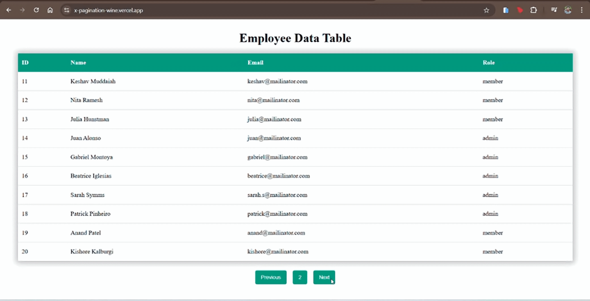

# XPagination

This React application fetches employee data from an API and displays it in a paginated table. It demonstrates the use of React hooks (`useState`, `useEffect`) for fetching and managing state, as well as how to implement pagination to navigate through large sets of data.

## Features
- **Pagination**: Navigate through employee data using "Previous" and "Next" buttons.
- **Dynamic Table**: Displays employee data (ID, Name, Email, Role) in a tabular format.
- **API Integration**: Fetches employee data from an external API and handles errors gracefully.

## Technologies Used
- **React**: The core library for building the user interface and managing the app's state.
- **Axios**: For making HTTP requests to fetch employee data from the API.
- **CSS**: For styling the app using both global and module-specific styles.

## How to Run the Project Locally

1. Clone the repository:
   ```
   git clone https://github.com/Sai-Karthik9113/XPagination.git
   ```
2. Navigate to the project directory:
   ```
   cd XPagination
   ```
3. Install dependencies:
   ```
   npm install
   ```
4. Start the development server:
   ```
   npm start
   ```
5. Open the app in your browser at `http://localhost:3000`.

## Screenshots

Here is a GIF showcasing the functionality of the paginated employee data table:



## Usage
1. Upon loading the app, the employee data will be fetched from the API.
2. Navigate through the data using the **Previous** and **Next** buttons for pagination.
3. The table displays the employee's ID, Name, Email, and Role.

## License
This project is licensed under the MIT License.

---

This is a student project as part of a React course assignment.

